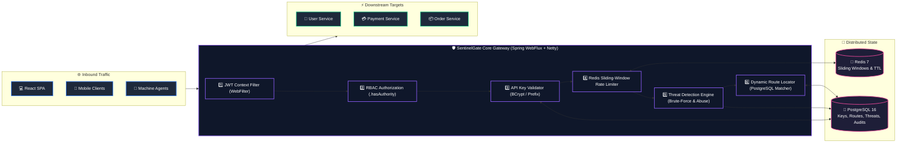

<div align="center">

# 🛡️ SentinelGate

### **Next-Gen Secure API Gateway & Real-Time Cyber Security Analytics Platform**

<p align="center">
  <a href="https://opensource.org/licenses/MIT"></a>
  <a href="https://adoptium.net/"></a>
  <a href="https://spring.io/projects/spring-boot"></a>
  <a href="https://spring.io/projects/spring-cloud-gateway"></a>
  <a href="https://redis.io/"></a>
  <a href="https://www.postgresql.org/"></a>
  <a href="https://react.dev/"></a>
  <a href="https://www.typescriptlang.org/"></a>
  <a href="https://tailwindcss.com/"></a>
  <a href="https://prometheus.io/"></a>
  <a href="https://grafana.com/"></a>
  <a href="https://docker.com/"></a>
</p>

<p align="center">
  
  
  
  
</p>

<p align="center">
  <b>SentinelGate</b> is an enterprise-grade, high-performance API Gateway and Security Operations Center (SOC) dashboard. Designed to sit at the perimeter of distributed systems, it delivers sub-millisecond threat mitigation, dynamic database-backed routing, distributed sliding-window rate limiting, cryptographic machine API key management, and live cyber threat telemetry.
</p>

</div>

---

## 🧭 Navigation

- [🌟 Why SentinelGate?](#-why-sentinelgate)
- [🧩 Architecture & Reactive Pipeline](#-architecture--reactive-pipeline)
- [✨ Core Capabilities](#-core-capabilities)
- [🔬 Technology Matrix](#-technology-matrix)
- [🚀 Quick Start (Docker in 60 Seconds)](#-quick-start-docker-in-60-seconds)
- [💻 Standalone Local Setup](#-standalone-local-setup)
- [📡 Live REST API Catalog](#-live-rest-api-catalog)
- [🛡️ Threat Detection Matrix](#️-threat-detection-matrix)
- [🧪 Verified Automated Test Suite](#-verified-automated-test-suite)
- [📊 Observability (Prometheus & Grafana)](#-observability-prometheus--grafana)
- [🔐 Security Policy](#-security-policy)
- [📄 MIT License](#-license)

---

## 🌟 Why SentinelGate?

Modern microservices require robust perimeter defense without sacrificing throughput. SentinelGate replaces static, legacy gateways with an intelligent, reactive security layer:



---

## 🧩 Architecture & Reactive Pipeline

> [!NOTE]
> **Zero-Thread-Starvation Guarantee**: All I/O is non-blocking. Database queries via Spring Data JPA run on dedicated `Schedulers.boundedElastic()` thread pools, isolating Netty's reactive event loops for continuous request processing.

```
                      INCOMING HTTP REQUEST
                                │
    ┌───────────────────────────▼───────────────────────────┐
    │  [ JwtSecurityContextFilter ]                         │
    │  Decodes HMAC-SHA512 token & populates SecurityContext│
    └───────────────────────────┬───────────────────────────┘
                                │
    ┌───────────────────────────▼───────────────────────────┐
    │  [ Spring Security RBAC ]                             │
    │  Enforces server-side .hasAuthority("ADMIN")          │
    │  ❌ Rejects unauthorized users with 403 Forbidden     │
    └───────────────────────────┬───────────────────────────┘
                                │
    ┌───────────────────────────▼───────────────────────────┐
    │  [ ApiKeyValidationFilter ]                           │
    │  Checks 'sg_live_' format & verifies BCrypt hash in DB│
    │  ❌ Rejects revoked/expired keys with 403 Forbidden   │
    └───────────────────────────┬───────────────────────────┘
                                │
    ┌───────────────────────────▼───────────────────────────┐
    │  [ RateLimiterFilter ]                                │
    │  Sliding-window counter in Redis (IP, User, API Key)  │
    │  ❌ Breached limit -> 429 TOO MANY REQUESTS + Retry-After
    └───────────────────────────┬───────────────────────────┘
                                │
    ┌───────────────────────────▼───────────────────────────┐
    │  [ Threat Detection & LoggingAuditFilter ]            │
    │  Tracks failed logins & increments Micrometer counters│
    └───────────────────────────┬───────────────────────────┘
                                │
    ┌───────────────────────────▼───────────────────────────┐
    │  [ DynamicRouteLocator ]                              │
    │  Matches path pattern to DB routes & forwards headers │
    └───────────────────────────┬───────────────────────────┘
                                │
                      DOWNSTREAM MICROSERVICE
```

---

## ✨ Core Capabilities

### 🔴 1. Adaptive Redis Sliding-Window Rate Limiter
- **Atomic sliding-window quotas** calculated per second/minute.
- **Dedicated Auth endpoint threshold** (20 req/min) to eliminate credential-stuffing attacks.
- **Standard Header Injection**: Injects `X-RateLimit-Limit`, `X-RateLimit-Remaining`, `X-RateLimit-Reset`, and `Retry-After`.
- Returns structured JSON error payloads with retry timers upon `HTTP 429`.

### 🟠 2. Dual-Layer Token & Machine Key Architecture
- **Stateless User Tokens**: HMAC-SHA512 JWTs with role claims (`ADMIN`, `DEVELOPER`, `VIEWER`).
- **Machine-to-Machine API Keys**: `sg_live_<8-hex-prefix>_<24-hex-secret>` tokens.
- **High-Performance Prefix Indexing**: Enables instant key revocation and status lookups without revealing raw secrets.

### 🟡 3. Rule-Based Threat Detection Engine
- Identifies **Brute-Force Attacks** (5 consecutive login failures within a 300s window).
- Enforces automated **Temporary IP Blocking** (`BLOCK_TEMPORARY`).
- Emits real-time `AUTH_FAILURE`, `RATE_LIMIT_EXCEEDED`, and `UNAUTHORIZED_ACCESS` events directly into PostgreSQL.

### 🟢 4. Dynamic Database-Backed Routing
- Zero-downtime route management.
- Register, update, and toggle microservice routes via Admin APIs.
- Downstream header enrichment with `X-User-Name`, `X-User-Role`, and `X-Client-Id`.

### 🔵 5. Real-Time SOC Analytics & Dashboard
- Dark-mode, cyberpunk-styled React 18 administrative console.
- **Zero-Fake Data**: Displays live metrics and 12 five-minute time-series buckets queried directly from PostgreSQL.
- Filter security events by severity (`CRITICAL`, `HIGH`, `MEDIUM`, `LOW`), event type, and keyword search.

### 🟣 6. Full Observability Pipeline
- Built-in Micrometer instrumentation exporting metrics to `/actuator/prometheus`.
- Pre-provisioned Grafana datasource and security dashboards (`docker/grafana/provisioning/`).

---

## 🔬 Technology Matrix

<table>
  <tr>
    <th align="center">Layer</th>
    <th align="center">Technology</th>
    <th align="center">Role / Implementation</th>
  </tr>
  <tr>
    <td align="center"><b>Core Engine</b></td>
    <td></td>
    <td>Virtual-thread-ready modern Java LTS runtime with pattern matching</td>
  </tr>
  <tr>
    <td align="center"><b>API Gateway</b></td>
    <td></td>
    <td>Reactive non-blocking routing engine built on Project Reactor & Netty</td>
  </tr>
  <tr>
    <td align="center"><b>Security</b></td>
    <td></td>
    <td>Reactive WebFilter chain, HMAC-SHA512 JWT parsing, BCrypt key hashing</td>
  </tr>
  <tr>
    <td align="center"><b>Cache & Limiter</b></td>
    <td></td>
    <td>Distributed sliding-window counters, atomic TTL expiry, brute-force tracking</td>
  </tr>
  <tr>
    <td align="center"><b>Primary Database</b></td>
    <td></td>
    <td>ACID relational storage for users, routes, API keys, audit logs, and security events</td>
  </tr>
  <tr>
    <td align="center"><b>Frontend Dashboard</b></td>
    <td></td>
    <td>Single-page SOC dashboard with Recharts time-series visualization & Tailwind CSS</td>
  </tr>
  <tr>
    <td align="center"><b>Observability</b></td>
    <td></td>
    <td>Micrometer metrics export, Prometheus scraping, Grafana dashboards</td>
  </tr>
  <tr>
    <td align="center"><b>Orchestration</b></td>
    <td></td>
    <td>Multi-container production stack with healthchecks and restart policies</td>
  </tr>
</table>

---

## 🚀 Quick Start (Docker in 60 Seconds)

```bash
# 1. Clone the repository
git clone https://github.com/VARDHAN2254/SentinelGate.git
cd SentinelGate/docker

# 2. Spin up all 6 production services
docker compose up --build -d
```

### 🌐 Access Points

| Component | URL | Default Credentials |
| :--- | :--- | :--- |
| **🛡️ SentinelGate SOC Console** | [http://localhost:80](http://localhost:80) | `admin` / `AdminSecret123!` |
| **⚡ Gateway Core API** | [http://localhost:8080](http://localhost:8080) | — |
| **📊 Grafana Analytics** | [http://localhost:3000](http://localhost:3000) | `admin` / `admin` |
| **📈 Prometheus Telemetry** | [http://localhost:9090](http://localhost:9090) | — |
| **💾 PostgreSQL Database** | `localhost:5432` | `sentinelgate_user` / `sentinelgate_password` |
| **🔴 Redis 7 Cache** | `localhost:6379` | — |

---

## 💻 Standalone Local Setup

```bash
# 1. Start required infrastructure containers
cd docker
docker compose up sentinelgate-postgres sentinelgate-redis prometheus grafana -d

# 2. Run Spring Boot Backend
cd ../backend
mvn spring-boot:run

# 3. Run React Frontend (Dev Server)
cd ../frontend
npm install
npm run dev
```

> [!TIP]
> **Instant Local Standalone Mode**: You can run the backend without any Docker dependencies using the local in-memory profile:  
> `mvn spring-boot:run -Dspring-boot.run.profiles=local`

---

## 📡 Live REST API Catalog

<details open>
<summary><b>🔐 Authentication & Identity Endpoints</b></summary>

```http
### Register a New Account
POST /api/v1/auth/register
Content-Type: application/json

{
  "username": "security_analyst",
  "email": "analyst@sentinelgate.io",
  "password": "StrongPassword123!",
  "role": "DEVELOPER"
}

### Login & Obtain JWT
POST /api/v1/auth/login
Content-Type: application/json

{
  "username": "admin",
  "password": "AdminSecret123!"
}

### Token Introspection (Requires Bearer Token)
GET /api/v1/auth/me
Authorization: Bearer <JWT_TOKEN>
```
</details>

<details open>
<summary><b>📊 Security Analytics & Telemetry Endpoints</b></summary>

```http
### Live Security Metrics Overview (Real DB Counts)
GET /api/v1/analytics/overview
Authorization: Bearer <JWT_TOKEN>

### 12 × 5-Minute Time-Series Traffic Timeline
GET /api/v1/analytics/traffic-timeline
Authorization: Bearer <JWT_TOKEN>

### Paginated & Filtered Security Events
GET /api/v1/analytics/events?page=0&size=20&severity=HIGH&eventType=AUTH_FAILURE
Authorization: Bearer <JWT_TOKEN>
```
</details>

<details>
<summary><b>⚙️ Admin Route & API Key Management (Requires ADMIN Role)</b></summary>

```http
### Create a New Machine API Key
POST /api/v1/admin/api-keys
Authorization: Bearer <ADMIN_JWT>
Content-Type: application/json

{
  "name": "Order Service Machine Key",
  "rateLimitPerMin": 500
}

### Instantly Revoke an API Key
POST /api/v1/admin/api-keys/1/revoke
Authorization: Bearer <ADMIN_JWT>

### Register a New Dynamic Gateway Route
POST /api/v1/admin/routes
Authorization: Bearer <ADMIN_JWT>
Content-Type: application/json

{
  "routeId": "payment_service_route",
  "serviceId": 1,
  "pathPattern": "/api/v1/payments/**",
  "requiresAuth": true,
  "allowedRoles": "ADMIN,DEVELOPER",
  "rateLimitPerMin": 300,
  "isActive": true
}
```
</details>

---

## 🛡️ Threat Detection Matrix

| Threat Vector | Detection Strategy | Gateway Enforcement Action | Telemetry Emitted |
| :--- | :--- | :--- | :--- |
| **Credential Stuffing** | Dedicated per-IP rate limit on `/api/v1/auth/**` (20 req/min) | `HTTP 429 Too Many Requests` + `Retry-After` | `AUTH_FAILURE` + Micrometer metric |
| **Brute-Force Login** | 5 failed login attempts per `ip:username` within 300s | `HTTP 401` + Automated `BLOCK_TEMPORARY` | `BRUTE_FORCE` Security Event |
| **Volumetric API Flood** | Sliding-window limits (100–1000 req/min based on subject) | `HTTP 429 Too Many Requests` + `Retry-After` | `RATE_LIMIT_EXCEEDED` Security Event |
| **Revoked Key Access** | Real-time DB lookup matching `keyPrefix` & `status=REVOKED` | `HTTP 403 Forbidden` | `API_KEY_REVOKED` Security Event |
| **Expired Key Access** | Real-time verification against `expiresAt` timestamp | `HTTP 403 Forbidden` | `API_KEY_EXPIRED` Security Event |
| **Malformed Token/Key** | Prefix validation + HMAC signature verification | `HTTP 401 Unauthorized` | Security Log Event |
| **Role Escalation** | Server-side WebFilter `.hasAuthority("ADMIN")` check | `HTTP 403 Forbidden` | `UNAUTHORIZED_ACCESS` Security Event |

---

## 🧪 Verified Automated Test Suite

SentinelGate enforces rigorous automated verification across 9 specialized test classes:

```bash
cd backend && mvn test
```

```
-------------------------------------------------------------------------------
 T E S T S
-------------------------------------------------------------------------------
[INFO] Running com.sentinelgate.integration.GatewaySecurityIntegrationTest
  - healthCheck_returnsUp                                            [PASS]
  - register_validUser_returns201                                    [PASS]
  - register_duplicateUsername_returns409                            [PASS]
  - login_validCredentials_returnsJwt                                [PASS]
  - login_wrongPassword_returns401                                   [PASS]
  - login_nonExistentUser_returns401                                 [PASS]
  - me_invalidJwt_returns401                                         [PASS]
  - me_noToken_returns401                                            [PASS]
  - me_validAdminToken_returnsProfile                                [PASS]
  - adminEndpoint_noToken_returns401                                 [PASS]
  - adminEndpoint_withViewerToken_returns403                         [PASS]
  - adminEndpoint_withAdminToken_returns200                          [PASS]
  - bruteForce_5FailedLogins_generatesAuthFailureEvents              [PASS]
  - apiKey_create_returnsRawKey                                      [PASS]
  - apiKey_fullLifecycle_createRevokeReject                          [PASS]
  - apiKey_malformed_returns401                                      [PASS]
  - apiKey_unknown_returns401                                        [PASS]
  - apiKey_expired_returns403                                        [PASS]
  - analytics_overview_returnsRealCounts                             [PASS]
  - analytics_timeline_returns12Buckets                              [PASS]
  - analytics_events_returnsPaginatedResults                         [PASS]
  - analytics_events_filterBySeverity                                [PASS]
  - analytics_events_filterByEventType                               [PASS]
  - auditLogs_adminCanView                                           [PASS]
  - securityRules_adminCanView                                       [PASS]
  - gatewayRoutes_adminCanView                                       [PASS]
[INFO] Running com.sentinelgate.integration.RateLimitE2EIntegrationTest
  - rateLimit_burstOf6_triggers429On6th                              [PASS]
  - rateLimit_identityIsolation_userBNotBlocked                      [PASS]
  - rateLimit_windowReset_allowedAgain                               [PASS]
[INFO] Running com.sentinelgate.security.JwtTokenProviderTest        [4 PASS]
[INFO] Running com.sentinelgate.service.AuthServiceTest              [4 PASS]
[INFO] Running com.sentinelgate.service.ApiKeyServiceTest            [2 PASS]
[INFO] Running com.sentinelgate.service.RateLimitingServiceTest      [3 PASS]
[INFO] Running com.sentinelgate.service.SecurityDetectionEngineTest [2 PASS]
[INFO] Running com.sentinelgate.service.AuditLogServiceTest          [2 PASS]
[INFO] Running com.sentinelgate.service.GatewayRouteServiceTest      [2 PASS]
[INFO] Running com.sentinelgate.SentinelGateApplicationTests         [1 PASS]

===============================================================================
RESULTS: 49 Tests run, 0 Failures, 0 Errors, 0 Skipped (100% Success)
===============================================================================
```

---

## 📊 Observability (Prometheus & Grafana)

SentinelGate instruments metrics natively through **Micrometer**:

- `sentinelgate_security_threats_total`: Threat counter tagged by `event_type` and `severity`.
- `sentinelgate_ratelimit_violations_total`: Rate-limit violations tagged by `subject` (`ip`, `user`, `apikey`).
- `jvm_memory_used_bytes`, `jvm_threads_live_threads`, and Netty I/O channel metrics.

```
                   PROMETHEUS & GRAFANA MONITORING FLOW
┌──────────────────────┐        Scrapes /actuator/prometheus       ┌────────────────────┐
│ SentinelGate Gateway ├──────────────────────────────────────────►│ Prometheus (9090)  │
└──────────────────────┘                                           └─────────┬──────────┘
                                                                             │ Auto-Provision
                                                                             ▼
                                                                   ┌────────────────────┐
                                                                   │  Grafana (3000)    │
                                                                   │ Security Dashboard │
                                                                   └────────────────────┘
```

---

## 🔐 Security Policy

Please review [SECURITY.md](SECURITY.md) for vulnerability disclosure guidelines.

- **Secrets Isolation**: All secrets are supplied via environment variables (`JWT_SECRET`, `SPRING_DATASOURCE_PASSWORD`, `ADMIN_PASSWORD`) with `.env.example` templates.
- **Zero Raw Secrets in DB**: Passwords and API keys are stored exclusively as one-way BCrypt hashes.

---

## 📄 License

This project is licensed under the terms of the **MIT License**.  
See the full license terms in [LICENSE](LICENSE).

```
MIT License

Copyright (c) 2026 VARDHAN2254

Permission is hereby granted, free of charge, to any person obtaining a copy
of this software and associated documentation files (the "Software"), to deal
in the Software without restriction, including without limitation the rights
to use, copy, modify, merge, publish, distribute, sublicense, and/or sell
copies of the Software, and to permit persons to whom the Software is
furnished to do so, subject to the following conditions:

The above copyright notice and this permission notice shall be included in all
copies or substantial portions of the Software.
```

---

<div align="center">
  <b>Developed & Maintained with 🛡️ by <a href="https://github.com/VARDHAN2254">VARDHAN2254</a></b>
</div>
